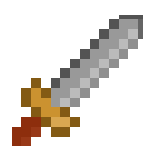
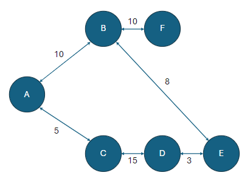
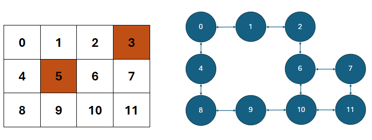

###### Readme top

<br />
<div align="center">
  <a href="http:\\excaliburjs.com">
    
  </a>

  <h3 align="center">Excalibur-Graph Plugin</h3>

  <p align="center">
    A plug in that assists in creating graph networks of nodes and edges, allowing for pathfinding, dijkstra's, dfs, and bfs algorithms
    <br />
    
  </p>
</div>

<!-- TABLE OF CONTENTS -->
<details>
  <summary>Table of Contents</summary>
  <ol>
    <li>
      <a href="#about-the-project">About The Plug-In</a>
      <ul>
        <li><a href="#built-with">Built With</a></li>
      </ul>
    </li>
    <li>
      <a href="#getting-started">Getting Started</a>
    </li>
    <li><a href="#usage">Usage</a>
      <ul>
        <li><a href="#usage-of-excalibur-concepts">Excalibur Concepts</a>
        <ul>
            <li><a href="#loader">Loader</a></li>
            <li><a href="#actor">Actor</a></li>
            <li><a href="#tilemap">Tilemap</a></li>
          </ul>
        </li >
        <li><a href="#usage-of-peasy-ui">Peasy-UI</a></li>
        <li><a href="#usage-of-the-graph-module">Graph module</a>
          <ul>
            <li><a href="#manual">Manual</a></li>
            <li><a href="#importing-tilemap">Tilemap</a></li>
          </ul>
        </li>
      </ul>
    </li>
    <li><a href="#contact">Contact</a></li>
    <li><a href="#acknowledgments">Acknowledgments</a></li>
  </ol>
</details>

<!-- ABOUT THE PROJECT -->

## About The Plug-In

This plug in creates a class that is a collection of nodes and edges.

In the API:

- adding nodes, edges, and resetting data
- Depth First Search between nodes (dfs)
- Breadth First Search between nodes (bfs)
- Dijkstra's Algorithm which analyzes the distance between starting node and all other connected nodes
- Shortest path, utilizing Dijkstra's Algo, we can return the shortest path between two nodes

<p align="right">(<a href="#readme-top">back to top</a>)</p>

<!-- GETTING STARTED -->

## Getting Started

To import the plug-in, from your shell:

```sh
npm i @excalibur/excalibur-graph
```

Declare and instantiate the new graph

```ts
import { ExcaliburGraph, GraphTileMap } from "@excaliburjs/excalibur-graph";
let myGraph = new ExcaliburGraph();
```

<!-- USAGE EXAMPLES -->

## Usage of the Graph Module

To use the Graph.ts module included with this project, you can build your 'graph' manually, or import a tilemap object and let the
module parse it itself.

### Types

What is a node?

```ts
type Node = {
  name: string;
  value?: any;
};
```

Nodes are discrete unis or vertices in the graph, they optionally can be provided some data of any type that can be associated with
that vertex. Nodes will be connected to other Nodes via Edges

What is an Edge?

```ts
type Edge = {
  name: string;
  from: Node;
  to: Node;
  value?: number;
};
```

Edges are the relationship betwee Nodes. The are unidirectional, as such they each have a required 'from' an 'to' property that
designates the direction of the edge. Also, an optional 'value' number property exists to assign a weight or distance value to the
Edge. This is very important for shortest path and Disjktra's Algorithm analysis. Tilemaps get imported with a default value of 1 for
each Edge.

Whay is a GraphTile?

```ts
export type GraphTile = {
  name?: string;
  index?: number;
  coordinates?: { x: number; y: number };
  data?: any;
  collider?: boolean;
};
```

A GraphTile is the atomic unit of a GraphTileMap. When a GraphTileMap is loaded and parsed, each unit is read as a GraphTile, and then
the parser looks for the collider property to establish the necessary relationships to the Tile's neighbor Tiles.

What is a GraphTileMap?

```ts
export type GraphTileMap = {
  name: string;
  tiles: Array<GraphTile>;
  rows: number;
  cols: number;
};
```

A GraphTileMap is a collection of GraphTiles along with the parameters for the tilemap dimensions. The 'tiles' property comes in as a
flat array, and the parser uses 'rows' and 'cols' to manage determining the shape of the tile map overall, including establishing the
neighbor Nodes with respect to each Node.

### Manual Entry



To manually load this example graph, we need to :

- Load each node using myGraph.addNode();

```ts
myGraph.addNode({ name: "a" });
myGraph.addNode({ name: "b" });
myGraph.addNode({ name: "c" });
myGraph.addNode({ name: "d" });
myGraph.addNode({ name: "e" });
myGraph.addNode({ name: "f" });
```

- manually load the edge relationship with distance values

```ts
myGraph.addEdge({ name: "ab", from: myGraph.nodes.get("a")!, to: myGraph.nodes.get("b")!, value: 10 }, true);
myGraph.addEdge({ name: "bf", from: myGraph.nodes.get("b")!, to: myGraph.nodes.get("f")!, value: 10 }, true);
myGraph.addEdge({ name: "ac", from: myGraph.nodes.get("a")!, to: myGraph.nodes.get("c")!, value: 5 }, true);
myGraph.addEdge({ name: "cd", from: myGraph.nodes.get("c")!, to: myGraph.nodes.get("d")!, value: 15 }, true);
myGraph.addEdge({ name: "de", from: myGraph.nodes.get("d")!, to: myGraph.nodes.get("e")!, value: 3 }, true);
myGraph.addEdge({ name: "be", from: myGraph.nodes.get("b")!, to: myGraph.nodes.get("e")!, value: 8 }, true);
```

- you are now free to run Depth First Search (dfs), Breadth First Search(bfs), Dijkstra's Algorithm, and find shortest path between
  nodes

\*\* dev's note, the `true` that's passed as last parameter automatically creates the reverse path to make it bi-directional

<p align="right">(<a href="#readme-top">back to top</a>)</p>

### Importing Tilemap



If you wanted to load this example tilemap on the left in order to 'create' the graph on the right...

- using a GraphTileMap object, create your tilemap config object

```ts
let tilemap: GraphTileMap = {
  name: "tilemap",
  tiles: [],
  rows: 3,
  cols: 4,
};
```

- load up your tiles with tile objects

example tile object

```ts
class Grass extends Tile {
  constructor() {
    super();
    this.name = "grass";
    this.collider = false;
  }
}
```

The graph parser simply consumes the collider property, and uses it to create the edge connections automatically, so if a tile is a
collider, and its true, then the 'node' won't be created, and it will influence/manipulate the graph design. This is visually
represented in the above image, where the 'wall' tiles do not show up in the graph.

```ts
tilemap.tiles = [
  new Grass(),
  new Grass(),
  new Grass(),
  new Wall(),
  new Grass(),
  new Wall(),
  new Grass(),
  new Grass(),
  new Grass(),
  new Grass(),
  new Grass(),
  new Grass(),
];
```

- Pass the tilemap to the Graph, and it will create your nodes and edges automatically

```ts
myGraph.addTileMap(tilemap);
```

<p align="right">(<a href="#readme-top">back to top</a>)</p>

### Output from Graph

#### DFS

The Depth First Search api is:

```ts
dfs(startnode: Node, endnode: Node, visited = new Set()): boolean
```

The dfs will conduct a node search to see if startnode can reach endnode. If its found, it returns true, else false.

#### BFS

The Breadth First Search api is:

```ts
bfs(startnode: Node, endnode: Node): boolean
```

The bfs will conduct a node search to see if startnode can reach endnode. If its found, it returns true, else false.

#### Dijkstra's Algorithm

the Dijkstra's Algorithm api is:

```ts
dijkstra(sourcenode: Node): Array<{ node: Node; distance: number; previous: Node | null }>
```

It takes the starting 'source' node as input, and will return an array of objects that include properties node, distance, and previous
node.

#### Shortest Path

the shortest path calculation api is:

```ts
shortestPath(startnode: Node, endnode: Node): Node[]
```

The shortest path method takes the starting node and ending node as params, and returns an array of nodes consistening of, and in
order, from starting node to ending node, and includes every node in between.

### Utility Methods

#### ResetGraph

```ts
resetGraph();
```

This method clears out the nodes and edges data, creating a clean graph.

#### getNodes() and getEdges()

```ts
getNodes();
getEdges();
```

These methods return a Map of the current overall collection of nodes and edges respectively.

####

```ts
getAdjacentNodes(node: Node): Node[];
getAdjacentEdges(node: Node): Edge[];
getAdjacentEdgesTo(node: Node): Edge[];
```

These methods will return information regaarding the neighbors and relationships of the Node passed in.

Since relationships have directions, the getAdjacentEdges and getAdjacentEdgesTo provide a list of the coming and going edges
respectively.

<!-- CONTACT -->

## Contact

Justin Young - [@jyoung424242 (Twitter)](https://twitter.com/your_username) - [Mookie4242 (itch.io)](https://mookie4242.itch.io/)

Project Link: [GitHub Repo: Excalibur-Graph](https://github.com/excaliburjs/excalibur-graph)

<p align="right">(<a href="#readme-top">back to top</a>)</p>

<!-- ACKNOWLEDGMENTS -->

## Acknowledgments

Special thanks to two great communities that are always available to jump in help, and inspire little projects like these!!!!

- [Excalibur Discord](https://discord.gg/yYY6hGVTf5)
- [Game Dev Shift Discord](https://discord.gg/BZMcuR3FBD)

<p align="right">(<a href="#readme-top">back to top</a>)</p>
